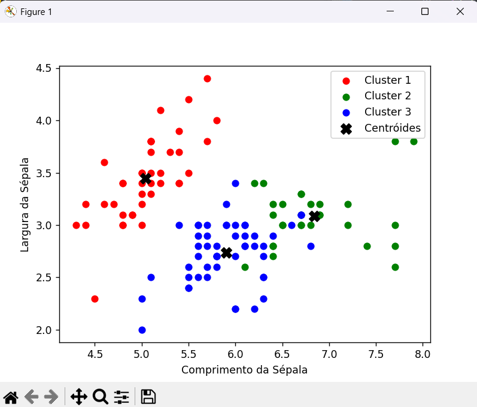

# Classificação com KNN aplicado ao Conjunto de Dados Iris

Este projeto foi desenvolvido como parte da disciplina **Sistemas Inteligentes**, ministrada pelo professor **Ricardo Tavares Antunes de Oliveira**, no curso **Superior de Tecnologia em Sistemas para Internet** do **Instituto Federal de Educação, Ciência e Tecnologia de Mato Grosso do Sul – Câmpus Coxim**.  

O trabalho é uma **continuidade** do repositório [MMCAC/cx-ifms-tsi-si-atv-02](https://github.com/MMCAC/cx-ifms-tsi-si-atv-02.git), expandindo os estudos práticos sobre algoritmos de classificação supervisionada.

---

## 📌 Objetivo

O projeto tem como objetivo aplicar o **algoritmo K-Nearest Neighbors (KNN)** no conjunto de dados **Iris**, explorando como esse método pode ser utilizado para classificar espécies de flores a partir de medidas como comprimento e largura de pétalas e sépalas.

---

## 📂 Estrutura do Código

O código realiza as seguintes etapas:

1. **Importação das bibliotecas**  
   - `pandas` e `numpy` para manipulação de dados.  
   - `matplotlib` para visualização gráfica.  
   - `scikit-learn` para uso do modelo KNN.  

2. **Carregamento do dataset Iris**  
   O conjunto de dados Iris é fornecido pela própria biblioteca `scikit-learn`.

3. **Divisão dos dados**  
   Separação em **dados de treino** e **dados de teste**.

4. **Criação e treinamento do modelo KNN**  
   Definição do número de vizinhos (`k`) e ajuste do modelo com os dados de treino.

5. **Avaliação do modelo**  
   - Predição sobre os dados de teste.  
   - Cálculo da acurácia.  
   - Exibição da matriz de confusão e relatórios de desempenho.  

6. **Visualização gráfica**  
   Utilização do `matplotlib` para representar a classificação em duas dimensões.

---

## ▶️ Como Executar

1. Certifique-se de ter o **Python 3.x** instalado e as bibliotecas necessárias:
   ```bash
   pip install matplotlib scikit-learn pandas numpy
   ```

2. Execute o script:
   ```bash
   python knnIrisMaicon.py
   ```

---

## 📊 Resultados Esperados



- Exibição da acurácia obtida pelo classificador.  
- Impressão da matriz de confusão.  
- Visualização gráfica mostrando como o KNN separou as classes de flores.  

---

## 📚 Referências

- Documentação do [Scikit-learn](https://scikit-learn.org/stable/)  
- Dataset Iris de [Ronald A. Fisher (1936)](https://archive.ics.uci.edu/ml/datasets/iris)  
